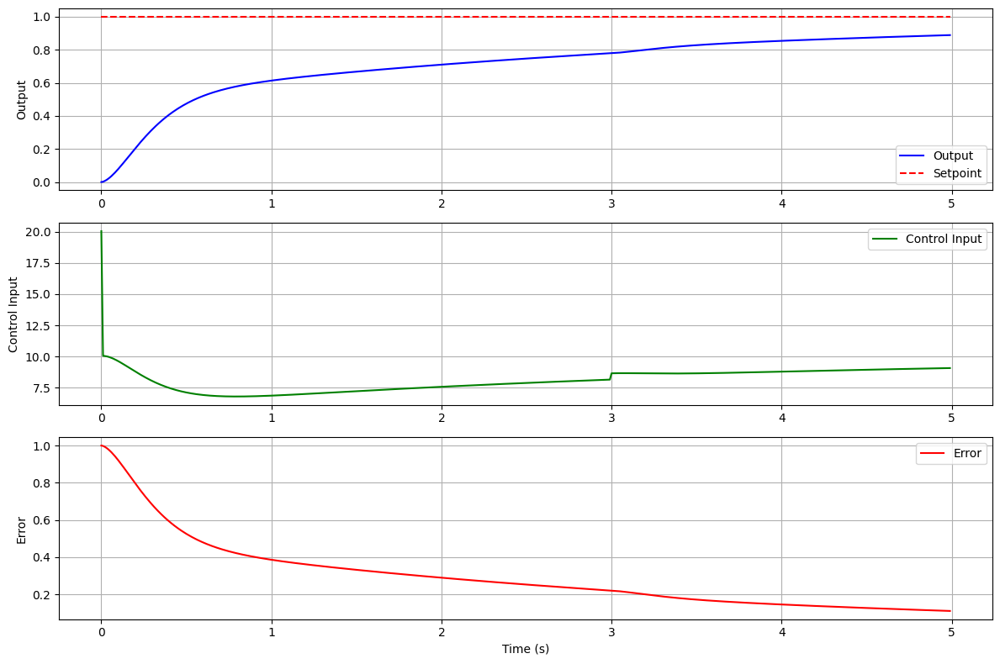

# PID Controller Simulator

A Python-based simulator for PID controllers, featuring modular design, interactive visualization, and extensible plant models. This project allows users to simulate various control systems, experiment with different PID gains, and analyze the system's response to disturbances.

## Features

### Modular Design
- **PID Controller**: Easily configurable \( K_p \), \( K_i \), \( K_d \), and setpoint parameters.
- **Extensible Plant Models**: Supports multiple plant models with realistic dynamics:
  - **DC Motor**: Simulates electrical and mechanical behavior.
  - **Inverted Pendulum**: Models full nonlinear dynamics for control experiments.
- **Simulator**: Handles state tracking, data export, and visualization.

### Core Functionalities
1. **Control System Simulation**:
   - Track state variables like error, input signal, and output response.
   - Inject disturbances to test robustness.
2. **Interactive Visualization**:
   - System response over time (output vs. setpoint).
   - Control input and error dynamics.
3. **Data Export**:
   - Save simulation results as JSON for further analysis.

## Installation

1. Clone the repository:
   ```bash
   git clone https://github.com/<your-username>/PID-Controller-Simulator.git
   ```
2. Navigate to the project folder:
   ```bash
   cd PID-Controller-Simulator
   ```
3. Install required libraries:
   ```bash
   pip install -r requirements.txt
   ```

## Usage

### Example: Simulating a DC Motor

```python
from simulator import DCMotor, PIDController, Simulator

# Create a DC motor and PID controller
motor = DCMotor()
controller = PIDController(Kp=10, Ki=5, Kd=0.1, setpoint=1.0)

# Set up and run the simulation
sim = Simulator(motor, controller, simulation_time=5)
results = sim.run(initial_conditions=[0, 0])

# Visualize the results
sim.plot_results()

# Export data to JSON
sim.export_data("results.json")
```

### Example: Simulating an Inverted Pendulum
```python
from simulator import InvertedPendulum, PIDController, Simulator

# Create an inverted pendulum and PID controller
pendulum = InvertedPendulum()
controller = PIDController(Kp=50, Ki=10, Kd=1, setpoint=0.0)

# Set up and run the simulation
sim = Simulator(pendulum, controller, simulation_time=10)
results = sim.run(initial_conditions=[0, 0, 0.1, 0])  # Initial tilt

# Visualize the results
sim.plot_results()
```

## Configuration

- **PID Parameters**: Adjust \( K_p \), \( K_i \), and \( K_d \) to tune the controller.
- **Simulation Settings**:
  - `simulation_time`: Total duration of the simulation.
  - `dt`: Time step for numerical integration.
- **Disturbances**: Inject disturbances at specific times to analyze system behavior.

## Visualization

The simulator uses Matplotlib to plot:
- Output vs. setpoint over time.
- Control input signal.
- Error dynamics.

Example output:




## Future Improvements

- Add more plant models (e.g., HVAC systems, robotic arms).
- Implement GUI for interactive simulations.
- Extend disturbance modeling to include stochastic noise.

## License

This project is licensed under the MIT License. See the `LICENSE` file for details.

## Contributing

Contributions are welcome! To contribute:
1. Fork the repository.
2. Create a feature branch: `git checkout -b feature-name`.
3. Commit changes: `git commit -m 'Add feature-name'`.
4. Push to your branch: `git push origin feature-name`.
5. Open a pull request.
